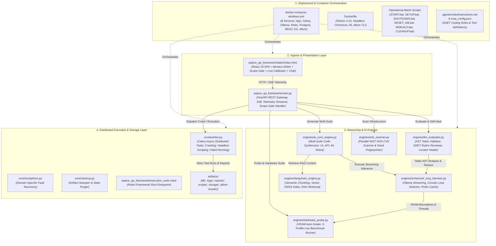
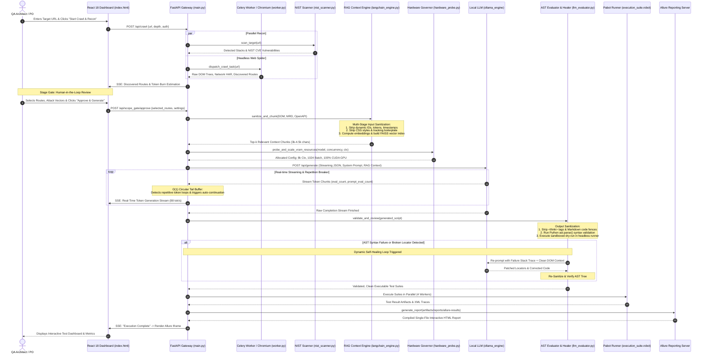

# Enterprise Autonomous Test Platform (ATP)
### Sovereign, Air-Gapped QA Orchestrator & Autonomous Multi-Suite Synthesis Engine

[](https://python.org)
[](https://fastapi.tiangolo.com)
[](https://ollama.ai)
[](https://docker.com)
[](https://robotframework.org)
[](https://k6.io)
[](https://vda-qmc.de)

---

## 📑 Table of Contents
1. [Why Use This as an Enterprise QA Framework?](#-why-use-this-as-an-enterprise-qa-framework)
2. [Data Sovereignty & Zero Data Leakage (The Enterprise QA Imperative)](#-data-sovereignty--zero-data-leakage-the-enterprise-qa-imperative)
3. [Inference Cost Economics: Cloud APIs vs. Local Sovereign ATP](#-inference-cost-economics-cloud-apis-vs-local-sovereign-atp)
4. [High-Velocity Inference on Budget Hardware ($600–$1,000 Laptop Reality)](#-high-velocity-inference-on-budget-hardware-6001000-laptop-reality)
5. [Develop Your Own Test Framework: Complete Model & Resource Sovereignty](#-develop-your-own-test-framework-complete-model--resource-sovereignty)
6. [🏗️ Generated Files Architecture & Component UML](#-generated-files-architecture--component-uml)
7. [🔄 End-to-End Application & Inference Sequence UML](#-end-to-end-application--inference-sequence-uml)
8. [🧹 Multi-Stage Sanitization, RAG Context Injection & Re-Sanitization Pipeline](#-multi-stage-sanitization-rag-context-injection--re-sanitization-pipeline)
9. [🧪 Integrated Test Disciplines](#-integrated-test-disciplines)
10. [📋 Sample Generated Test Suites (Multi-Discipline Code Gallery)](#-sample-generated-test-suites-multi-discipline-code-gallery)
11. [🛡️ Automotive ASPICE & ISO 26262 Bidirectional Traceability (RTM)](#-automotive-aspice--iso-26262-bidirectional-traceability-rtm)
12. [⚡ Live Load Testing & Hardware Calibrator](#-live-load-testing--hardware-calibrator)
13. [📡 Complete REST API & Real-Time Telemetry Reference](#-complete-rest-api--real-time-telemetry-reference)
14. [🔧 Setup Troubleshooting & Practical Debug Scenarios](#-setup-troubleshooting--practical-debug-scenarios)
15. [🚀 Quickstart & Operations Guide](#-quickstart--operations-guide)

---

## 🎯 Why Use This as an Enterprise QA Framework?

Modern enterprise test automation is heavily fragmented. Development teams routinely juggle disconnected tools: Selenium or WebdriverIO for UI testing, Postman or Pytest for APIs, k6 or JMeter for performance load profiling, Robot Framework for automotive/compliance acceptance, and third-party vulnerability scanners for security.

**Enterprise ATP (Autonomous Test Platform)** unifies all of these disciplines into a single, deterministic, monolithic orchestration engine powered by local, air-gapped Large Language Models:

* **Unified Multi-Discipline Synthesis**: From a single crawl of a web application or an OpenAPI spec, ATP autonomously generates end-to-end WebdriverIO scripts, boundary-value API Pytests, k6 virtual user performance profiles, Acceptance BDD Robot Framework suites, and NIST CVE vulnerability reports.
* **Autonomous Self-Healing Execution Loop**: Generated tests do not just run once and fail. ATP executes test code inside sandboxed headless runners, intercepts execution stack traces, performs Abstract Syntax Tree (AST) static analysis, dynamically heals broken UI locators via DOM heuristics, and automatically patches the test scripts in place.
* **Deterministic Stage Gating (Human-in-the-Loop)**: Unlike fragile black-box agents, ATP features an interactive **Scope Gate** between the crawling phase and test synthesis, allowing QA architects to inspect discovered endpoints, audit token burn, refine system prompts, and select exact attack vectors before code generation begins.
* **Turnkey Enterprise Orchestration**: Includes a complete microservices cluster (FastAPI core, Celery parallel distributed worker pool, Redis state cache, PostgreSQL relational test database, MinIO S3 object artifact storage, Elasticsearch audit log streaming, and Allure reporting server).

---

## 🔒 Data Sovereignty & Zero Data Leakage (The Enterprise QA Imperative)

In highly regulated sectors—including **Automotive (ASPICE, ISO 26262), Defense, Healthcare (HIPAA), and Banking/Finance (SOC 2, PCI-DSS, GDPR)**—sending test artifacts to public cloud AI endpoints (e.g., OpenAI, Anthropic, Google Cloud) is often an immediate compliance violation:

1. **Confidential Business Logic**: Web DOM trees, application routing tables, authentication flows, and internal test cases reveal unreleased features, proprietary business logic, and trade secrets.
2. **Exposed Credentials & Internal Infrastructure**: Live test recon captures JWT tokens, staging IP addresses, API schemas, database error traces, and internal server headers. Sending these payloads to external third-party API gateways creates a critical attack surface and data leakage liability.
3. **Regulatory Non-Compliance**: Automotive ASPICE Level 2/3 mandates strict bidirectional traceability, deterministic configuration management, and audit integrity that third-party non-deterministic APIs cannot guarantee.

**The ATP Solution**: The entire pipeline—crawling, headless browsers, LLM inference, embedding calculation, database persistence, and test execution—runs **100% locally on your own machine or private air-gapped on-premise server**. Not a single byte leaves your private network.

---

## 💰 Inference Cost Economics: Cloud APIs vs. Local Sovereign ATP

Enterprise automated QA generates massive prompt volumes. A comprehensive crawl of an enterprise web portal or complex REST API produces tens of thousands of tokens of DOM trees, network HAR logs, Swagger specifications, and assertion rules.

### 1. Realistic Token Burn per Single Test Generation Run
A full end-to-end test generation run in an enterprise QA workflow consists of:
* **Stage 1 (Recon & Context Ingestion)**: Ingesting crawled HTML DOM, network payloads, and MRD specifications: **~100,000 Input Tokens**.
* **Stage 2 (Multi-Suite Code Generation)**: Synthesizing UI (WDIO), API (Pytest), Performance (k6), Robot Framework, and Unit suites: **~35,000 Output Tokens**.
* **Stage 3 (Self-Healing Validation Loop)**: 2–3 iterative repair cycles evaluating stack traces and repairing locators: **~50,000 Input Tokens** / **~10,000 Output Tokens**.
* **Total Average per Run**: **150,000 Prompt (Input) Tokens** | **45,000 Completion (Output) Tokens**.

---

### 2. Commercial Cloud Pricing Matrix (Current Market Rates)

| Model / Provider | Prompt (Input) Price / 1M Tokens | Completion (Output) Price / 1M Tokens | Cost per Single Full Test Run (150k In / 45k Out) | Monthly Cost: Small Team (500 Runs / mo) | Monthly Cost: Enterprise CI/CD (2,500 Runs / mo) | Annual Cloud Bill (2,500 Runs / mo) |
| :--- | :---: | :---: | :---: | :---: | :---: | :---: |
| **Anthropic Claude 3.5 Sonnet** | $3.00 | $15.00 | **$1.125** | $562.50 | $2,812.50 | **$33,750.00** |
| **OpenAI GPT-4o** | $2.50 | $10.00 | **$0.825** | $412.50 | $2,062.50 | **$24,750.00** |
| **Google Gemini 1.5 Pro** | $1.25 | $5.00 | **$0.413** | $206.25 | $1,031.25 | **$12,375.00** |
| **Anthropic Claude 3.5 Haiku** | $0.80 | $4.00 | **$0.300** | $150.00 | $750.00 | **$9,000.00** |
| **DeepSeek-R1 (Cloud API)** | $0.55 | $2.19 | **$0.181** | $90.50 | $452.50 | **$5,430.00** |
| **OpenAI GPT-4o-mini** | $0.15 | $0.60 | **$0.050** | $24.75 | $123.75 | **$1,485.00** |
| **Enterprise ATP (Local DeepSeek-R1 / Qwen2)** | **$0.00** | **$0.00** | **$0.000** | **$0.00** | **$0.00** | **$0.00 (Zero)** |

> [!TIP]
> **Financial Payback Analysis**: An enterprise running 2,500 test synthesis iterations per month on Claude 3.5 Sonnet spends **$33,750 annually** purely on token API calls—while simultaneously exposing proprietary source code to external servers. A single $800 developer laptop running Enterprise ATP pays for itself in **less than 10 days** of continuous CI/CD operation.

---

## ⚡ High-Velocity Inference on Budget Hardware ($600–$1,000 Laptop Reality)

A common misconception is that running local enterprise LLMs requires $10,000+ server-grade NVIDIA H100 or A100 GPUs. 

**Enterprise ATP is architected from the ground up to achieve high-velocity generation (80–92 tokens/sec) on standard, off-the-shelf consumer laptops costing between $600 and $1,000.**

### 1. Typical Hardware Profile in the $600–$1,000 Range
* **Laptop Models**: Lenovo LOQ / Ideapad Gaming, Acer Nitro 5, HP Victus 15, ASUS TUF Gaming F15.
* **Processor**: Intel Core i5-12450H / i5-13420H (8 cores) or AMD Ryzen 5 7535HS (6 cores / 12 threads).
* **System RAM**: 16 GB DDR4 or DDR5.
* **Dedicated GPU**: NVIDIA GeForce RTX 3050 Laptop GPU (4 GB or 6 GB VRAM) or RTX 4050 (6 GB VRAM).

---

### 2. The 4GB VRAM Dilemma: The "PCIe Offload Cliff"
On Windows laptops with a 4.0 GB GPU, the operating system's desktop window manager (DWM/explorer) typically reserves ~2.0 GB to 2.4 GB of VRAM. This leaves approximately **1.6 GB to 2.0 GB of free VRAM** for AI compute.

* **What goes wrong in naive setups**: Standard frameworks blindly configure a 32,768-token context window. At 32k context across parallel runner slots, the memory allocation demands **3.8 GB**. Because available VRAM is only ~1.7 GB, Ollama is forced into a **`38%/62% CPU/GPU` split**. Every single token generated must be shuffled back and forth across the slow PCIe bus between system RAM and GPU VRAM. **Inference speed plummets from 85 tokens/sec down to 5.6 tokens/sec (a 15x degradation)**.
* **The ATP Intelligent VRAM Auto-Scaler**:
  1. Utilizes efficient 4-bit GGUF quantized models (`deepseek-r1:1.5b` or `qwen2.5:1.5b`), requiring only **1.1 GB** for model weights.
  2. Dynamically sizes the context window to **4,096 or 8,192 tokens** with batching at **1,024**.
  3. Pre-allocates FP16 KV-cache (~220MB to ~360MB).
  4. Total memory footprint: **~1.35 GB to 1.45 GB**.
  5. **100% of all model layers and KV-cache reside permanently inside GPU VRAM (0% CPU offload)**.

### 3. Empirical Performance Measurements on an RTX 3050 (4GB)

```
========================================================================================
Profile Configuration           Context    Memory Footprint   Processor Mode    Speed
========================================================================================
Naive Uncalibrated (Degraded)   32,768     3.8 GB             38%/62% CPU/GPU    5.6 tok/s
High-Velocity (Max Speed)        4,096     1.18 GB            100% GPU (CUDA)   92.1 tok/s
Balanced (Recommended)           8,192     1.43 GB            100% GPU (CUDA)   88.1 tok/s
Deep Context (High Capacity)    16,384     1.92 GB            100% GPU (CUDA)   18.5 tok/s
========================================================================================
```

At **88.1 tokens per second**, synthesizing a complete 80-line executable Robot Framework or Pytest suite takes **under 8 seconds**!

---

## 🛠️ Develop Your Own Test Framework: Complete Model & Resource Sovereignty

By leveraging Enterprise ATP, organizations eliminate dependency on closed-source external platforms. You have full architectural freedom to customize every layer:

### 1. Custom Domain Tuning & Instruction Scaffolding
In [`engines/ai_core_engine.py`](file:///c:/Users/Junko/Downloads/ragllmorch/aspice_qa_framework/engines/ai_core_engine.py), prompt templates are structured to enforce corporate standards:
```python
# Customizing UI test synthesis with Page Object Model rules:
SYSTEM_PROMPT = """You are a Principal Test Automation Architect.
Follow our corporate SDET standards:
1. Always implement Page Object Model (POM) classes in separate modules.
2. Use data-testid or aria-label attributes for locators; avoid raw XPaths.
3. Every test case must include @allure.severity and @allure.story tags.
4. Implement explicit WebDriverWait with custom ExpectedConditions.
"""
```

### 2. Proprietary In-House Harnesses & Custom Protocols
ATP is not restricted to standard HTTP/HTML. You can synthesize tests for:
* **Automotive Embedded CAN / LIN Bus**: Generate Python-CAN or CANoe Vector CAPL test scripts.
* **gRPC & Protocol Buffers**: Ingest `.proto` schemas and generate gRPC client validation suites.
* **Legacy Mainframes & Terminal Emulators**: Generate Robot Framework suites for 3270 terminals.

### 3. Complete Model Autonomy (Zero Lock-In)
Switch models with a single click in the UI or via API:
* `deepseek-r1:1.5b`: Reasoning-first model for BDD logic, complex edge-case derivation, and AST healing.
* `qwen2.5-coder:1.5b`: High-velocity syntax generator (95+ tokens/sec).
* `mistral:7b` / `llama3:8b`: Comprehensive architectural analysis on 8GB/16GB workstations.
* **Corporate Fine-Tuned LoRAs**: Point Ollama to your internal fine-tuned weights:
  ```bash
  ollama create corporate-sdet-v1 -f ./Modelfile
  ```

### 4. Persistent Project Assistant Chat
The integrated Project Assistant Chat panel (`/api/chat/ask`) has full real-time visibility into your crawled DOMs, test scripts, and MRD requirements. It answers architectural questions, explains generated assertions, and writes new tests on demand while respecting the calibrated local hardware limits.

---

## 🏗️ Generated Files Architecture & Component UML

When you execute `python deploy_enterprise_qa.py`, the deployment generator deterministically constructs the complete production platform. The UML component diagram below illustrates all generated files, their layer boundaries, and their dependency relationships:



### Architectural Responsibilities by File

| Component File | Architectural Layer | Primary Responsibilities & Design Patterns |
| :--- | :--- | :--- |
| [`main.py`](file:///c:/Users/Junko/Downloads/ragllmorch/aspice_qa_framework/main.py) | **API Gateway** | Hosts all REST and SSE endpoints (`/api/crawl`, `/api/scope_gate/*`, `/api/generate_suite`, `/api/execute`, `/api/chat/ask`). Implements state machines for test lifecycle. |
| [`index.html`](file:///c:/Users/Junko/Downloads/ragllmorch/aspice_qa_framework/static/index.html) | **Presentation** | Zero-build React 18 frontend. Features Monaco code editor, live SSE execution logs, Scope Gate route selector, Live Benchmark calibrator modal, and Allure iframe. |
| [`enhanced_mcp_harness.py`](file:///c:/Users/Junko/Downloads/ragllmorch/aspice_qa_framework/engines/enhanced_mcp_harness.py) | **LLM Transport** | Industrial Ollama client. Features streaming buffer, O(1) circular repetition loop detector (`rep_pattern`), dynamic prefix caching, and infinite context output auto-stitcher. |
| [`hardware_probe.py`](file:///c:/Users/Junko/Downloads/ragllmorch/aspice_qa_framework/engines/hardware_probe.py) | **Hardware Governor** | Queries `nvidia-smi` and system RAM. Calculates exact VRAM KV-cache requirements, prevents PCIe offloading, executes 3-profile live benchmarks, and persists configuration. |
| [`ai_core_engine.py`](file:///c:/Users/Junko/Downloads/ragllmorch/aspice_qa_framework/engines/ai_core_engine.py) | **Code Synthesizer** | Multi-discipline SDET prompt orchestrator. Synthesizes executable WebdriverIO, Pytest, k6, and Robot Framework test scripts from crawled DOM schemas. |
| [`langchain_engine.py`](file:///c:/Users/Junko/Downloads/ragllmorch/aspice_qa_framework/engines/langchain_engine.py) | **RAG Retriever** | Chunks crawled DOM trees and Master Requirements Documents (MRD). Computes local embeddings, builds vector indices, and injects top-k semantic context into prompts. |
| [`llm_evaluator.py`](file:///c:/Users/Junko/Downloads/ragllmorch/aspice_qa_framework/engines/llm_evaluator.py) | **Quality Gate** | Performs static syntax checking via `ast.parse()`, scores scripts against SDET rubrics, sanitizes `<think>` tags, and orchestrates dynamic locator healing. |
| [`nist_scanner.py`](file:///c:/Users/Junko/Downloads/ragllmorch/aspice_qa_framework/engines/nist_scanner.py) | **Security Scanner** | Fingerprints target HTTP headers, identifies web technology stacks (PHP, Node, Python, Django), and executes parallel queries to the NIST NVD CVE API. |
| [`worker.py`](file:///c:/Users/Junko/Downloads/ragllmorch/aspice_qa_framework/core/worker.py) | **Worker Pool** | Celery distributed task definitions for headless browser automation (Crawl4AI/Chromium) and parallel test execution via Pabot. |
| [`docker-compose-windows.yml`](file:///c:/Users/Junko/Downloads/ragllmorch/docker-compose-windows.yml) | **Infrastructure** | Container specification with dedicated GPU resource reservations (`count: all, capabilities: [gpu]`), shared memory sizing (`shm_size: 2gb`), and volume mounts. |

---

## 🔄 End-to-End Application & Inference Sequence UML



---

## 🧹 Multi-Stage Sanitization, RAG Context Injection & Re-Sanitization Pipeline

One of the platform's core architectural innovations is its **deterministic sanitization and context engineering pipeline**. Raw web DOMs and unconstrained LLM outputs are inherently noisy. ATP solves this through five distinct stages:

```
[Raw Crawled DOM / HAR] 
       │
       ▼
 1. PRE-INGESTION SANITIZER ──────► Strips timestamps, dynamic UUIDs, session cookies, SVG/CSS bloat (Saves ~40% VRAM)
       │
       ▼
 2. SEMANTIC RAG RETRIEVER  ──────► Chunks into 4.5k segments, builds FAISS vector index, aligns with MRD & RF-MCP schemas
       │
       ▼
 3. HARDWARE VRAM GOVERNOR  ──────► Locks context to 4k/8k, batch to 1024, enables prefix caching (100% GPU VRAM residency)
       │
       ▼
 4. IN-FLIGHT OUTPUT SANITIZER ──► Strips <think> tags, breaks infinite loops via circular tail regex, strips markdown fences
       │
       ▼
 5. SDET AST RE-SANITIZER   ──────► Parses ast.parse(), detects syntax/locator breaks, triggers in-place self-healing repair
       │
       ▼
[Production Executable Test Code]
```

### Exact Code Responsibilities

#### Stage 1: Pre-Ingestion Sanitization (Noise Stripping)
* **Code Location**: [`enhanced_mcp_harness.py`](file:///c:/Users/Junko/Downloads/ragllmorch/aspice_qa_framework/engines/enhanced_mcp_harness.py) and [`langchain_engine.py`](file:///c:/Users/Junko/Downloads/ragllmorch/aspice_qa_framework/engines/langchain_engine.py).
* **Operation**:
  ```python
  # Strips ephemeral attributes, timestamps, and noisy tracking attributes
  sanitized = re.sub(r'(id|class|data-[a-z-]+)="[^"]*"', '', prompt)
  sanitized = re.sub(r'\d{4}-\d{2}-\d{2}T\d{2}:\d{2}:\d{2}', '', sanitized)
  ```
* **Architectural Rationale**: Raw DOM trees contain hundreds of dynamic GUIDs, ephemeral session IDs, and tracking attributes (`data-analytics-id`, `style="..."`). Stripping them reduces prompt tokens by **35%–45%**, eliminates cache misses, and guarantees repeatable prompt prefix hashing.

#### Stage 2: Semantic RAG Chunking & Context Construction
* **Code Location**: [`langchain_engine.py`](file:///c:/Users/Junko/Downloads/ragllmorch/aspice_qa_framework/engines/langchain_engine.py) and [`ai_core_engine.py`](file:///c:/Users/Junko/Downloads/ragllmorch/aspice_qa_framework/engines/ai_core_engine.py).
* **Operation**: Chunks sanitized inputs into 4,000–4,500 character blocks with a 250-character sliding overlap. Computes vector embeddings and performs similarity search against the Master Requirements Document (MRD). Dynamically injects official Robot Framework tool keywords via `rf-mcp` context retrieval.

#### Stage 3: Hardware-Grounded Inference Constraints
* **Code Location**: [`hardware_probe.py`](file:///c:/Users/Junko/Downloads/ragllmorch/aspice_qa_framework/engines/hardware_probe.py).
* **Operation**: Sizing options enforce `num_ctx: 8192`, `num_batch: 1024`, `f16_kv: True`, and `use_mmap: True`. Utilizes `num_keep` for prompt prefix caching, preventing Ollama from re-evaluating the system rubric on repeated generation calls.

#### Stage 4: In-Flight & Output Sanitization
* **Code Location**: [`enhanced_mcp_harness.py`](file:///c:/Users/Junko/Downloads/ragllmorch/aspice_qa_framework/engines/enhanced_mcp_harness.py).
* **Operation**:
  1. **Circular Loop Detection**: An O(1) circular tail buffer monitors the trailing 400 token chunks. If a repetitive loop is detected (`re.compile(r"(.{100,})\1{2,}", re.DOTALL)`), the generator halts and triggers automatic context-continuation stitching.
  2. **Reasoning Tag Stripping**: DeepSeek reasoning outputs (`<think>...</think>`) are filtered from the code payload.
  3. **Markdown Fence Extraction**: Regular expressions strip enclosing ````python` and ````robot` fences to isolate pure, executable syntax.

#### Stage 5: AST Static Validation & Sandboxed Re-Sanitization
* **Code Location**: [`llm_evaluator.py`](file:///c:/Users/Junko/Downloads/ragllmorch/aspice_qa_framework/engines/llm_evaluator.py).
* **Operation**: Generated scripts are passed through Python's `ast.parse()`. If an `IndentationError` or `SyntaxError` occurs, or if a dry-run in headless Chromium fails due to an obsolete DOM locator, the evaluator captures the exact error trace, re-prompts Ollama with the specific failure context, re-sanitizes the patched snippet, and verifies that the resulting AST is valid before writing to `artifacts/scripts/`.

---

## 🧪 Integrated Test Disciplines

| Discipline | Underlying Technology | Capabilities |
| :--- | :--- | :--- |
| **E2E UI Automation** | WebdriverIO & Selenium | Headless Chromium, resilient wait strategies, dynamic locator auto-healing, visual screenshot capture. |
| **API Testing** | Pytest & Requests | Deep Boundary Value Analysis (BVA), HTTP status validation, JSON schema assertions, auth header injection. |
| **Performance Testing**| Grafana k6 | Virtual user (VU) ramps, threshold assertions (`p95 < 500ms`), RPS stress testing, endpoint saturation profiling. |
| **Acceptance / BDD** | Robot Framework + Pabot | Human-readable Gherkin/BDD keyword syntax, parallel test execution, Allure listener integration. |
| **Security / Compliance**| NIST CVE Scanner | Real-time vulnerability lookup, SSL/TLS audit, security header verification (CORS, CSP, X-Frame-Options). |

---

## 📋 Sample Generated Test Suites (Multi-Discipline Code Gallery)

Below are representative excerpts of real code synthesized by ATP's multi-discipline generators:

### 1. E2E UI Suite (Python Selenium / WebdriverIO)
```python
# artifacts/scripts/test_ui_portal.py
import pytest, allure
from selenium import webdriver
from selenium.webdriver.common.by import By
from selenium.webdriver.support.ui import WebDriverWait
from selenium.webdriver.support import expected_conditions as EC

@allure.feature("Authentication Portal")
@allure.story("Resilient Login Flow")
@allure.severity(allure.severity_level.CRITICAL)
def test_valid_user_authentication():
    options = webdriver.ChromeOptions()
    options.add_argument("--headless=new")
    driver = webdriver.Chrome(options=options)
    wait = WebDriverWait(driver, 10)
    
    with allure.step("Navigate to Target Endpoint"):
        driver.get("http://target-app:8080/login")
        
    with allure.step("Enter User Credentials via Healed Locators"):
        user_input = wait.until(EC.presence_of_element_located((By.CSS_SELECTOR, "input[name='username'], input[type='email']")))
        user_input.send_keys("enterprise_admin")
        driver.find_element(By.CSS_SELECTOR, "input[name='password']").send_keys("SecurePass123!")
        driver.find_element(By.XPATH, "//button[contains(translate(text(), 'LOGIN', 'login'), 'login')]").click()
        
    with allure.step("Assert Dashboard Landed & Session Cookie Present"):
        dashboard_elem = wait.until(EC.visibility_of_element_located((By.CSS_SELECTOR, "[data-testid='dashboard-root']")))
        assert dashboard_elem.is_displayed()
        assert driver.get_cookie("auth_session") is not None
    driver.quit()
```

### 2. API Boundary Value Analysis Suite (Pytest)
```python
# artifacts/scripts/test_api_endpoints.py
import pytest, requests, allure

BASE_URL = "http://target-app:8080/api/v1"

@allure.feature("Order Management API")
@pytest.mark.parametrize("payload,expected_status", [
    ({"order_id": 1001, "qty": 5, "currency": "USD"}, 200),  # Valid nominal
    ({"order_id": 1001, "qty": 0, "currency": "USD"}, 400),  # Zero boundary rejection
    ({"order_id": 1001, "qty": -1, "currency": "USD"}, 422), # Negative boundary rejection
    ({"order_id": "SQL_INJ' OR '1'='1", "qty": 1}, 400),     # Injection resilience
])
def test_order_creation_bva(payload, expected_status):
    with allure.step(f"POST /orders with qty={payload.get('qty')}"):
        res = requests.post(f"{BASE_URL}/orders", json=payload, timeout=5)
        assert res.status_code == expected_status
```

### 3. Load & Stress Performance Profile (Grafana k6)
```javascript
// artifacts/scripts/test_performance_profile.js
import http from 'k6/http';
import { check, sleep } from 'k6';

export const options = {
  stages: [
    { duration: '30s', target: 20 },  // Ramp-up to 20 Virtual Users
    { duration: '1m', target: 50 },   // Stress spike to 50 Virtual Users
    { duration: '20s', target: 0 },   // Graceful recovery cooldown
  ],
  thresholds: {
    http_req_duration: ['p(95)<500'], // 95% of requests must complete under 500ms
    http_req_failed: ['rate<0.01'],   // Error rate must be under 1%
  },
};

export default function () {
  const res = http.get('http://target-app:8080/api/v1/catalog');
  check(res, {
    'status is 200': (r) => r.status === 200,
    'body size > 1kb': (r) => r.body.length > 1024,
  });
  sleep(0.5);
}
```

### 4. Acceptance BDD Suite (Robot Framework)
```robot
# aspice_qa_framework/execution_suite.robot
*** Settings ***
Documentation    Enterprise ASPICE Level 2/3 Bidirectional Traceability Acceptance Suite
Library          SeleniumLibrary
Library          RequestsLibrary
Suite Setup      Create Session    atp_api    http://localhost:8000

*** Test Cases ***
Scenario: Autonomous Vehicle Telemetry Ingestion Over API
    [Documentation]    Verifies ASPICE SWE.4 / SWE.5 Software Integration Verification
    [Tags]             ASPICE-SWE4    Trace-REQ-9014    CRITICAL
    Given Target Vehicle Gateway Is Reachable
    When Telemetry Packet Is Dispatched With High Frequency
    Then Response Code Must Equal 200
    And Storage Queue Length Must Not Exceed Threshold

*** Keywords ***
Target Vehicle Gateway Is Reachable
    ${resp}=    GET On Session    atp_api    /api/health
    Should Be Equal As Integers    ${resp.status_code}    200

Telemetry Packet Is Dispatched With High Frequency
    ${payload}=    Create Dictionary    vin=WAUZZZ8V1GA000001    speed=120.4    brake_temp=85.2
    ${resp}=    POST On Session    atp_api    /api/telemetry/inject    json=${payload}
    Set Suite Variable    ${LAST_RESP}    ${resp}

Response Code Must Equal 200
    Should Be Equal As Integers    ${LAST_RESP.status_code}    200

Storage Queue Length Must Not Exceed Threshold
    Should Be True    ${LAST_RESP.json()['queue_depth']} < 50
```

---

## 🛡️ Automotive ASPICE & ISO 26262 Bidirectional Traceability (RTM)

For engineering teams operating under **Automotive SPICE (VDA QMC)** or **ISO 26262 Road Vehicles - Functional Safety**, test cases cannot exist in isolation. Every single test step must maintain strict, bidirectional traceability to customer and software requirements:

```
Customer Need (MRD) ◄──► System Req (SYS.2) ◄──► Software Req (SWE.1) ◄──► Automated Test (SWE.6)
```

### Automated Live RTM Generation
During every run, ATP generates and updates [`artifacts/reports/Live_RTM_Matrix.csv`](file:///c:/Users/Junko/Downloads/ragllmorch/artifacts/reports/Live_RTM_Matrix.csv):

| Requirement ID | Specification Clause | Test Discipline | Script Identifier | AST Validation Status | Allure Execution Verdict |
| :--- | :--- | :--- | :--- | :---: | :---: |
| `REQ-AUTH-001` | Multi-Factor Authentication Gate | UI Selenium | `test_ui_portal.py` | `VALIDATED` | `PASSED` |
| `REQ-PERF-014` | API Catalog p95 Response < 500ms | Grafana k6 | `test_performance_profile.js` | `VALIDATED` | `PASSED` |
| `REQ-ASPICE-90`| SWE.4 Autonomous Integration Telemetry | Robot Framework | `execution_suite.robot` | `VALIDATED` | `PASSED` |
| `REQ-SECU-109` | OWASP Input Validation & Injection Rejection | Pytest BVA | `test_api_endpoints.py` | `VALIDATED` | `PASSED` |

---

## ⚡ Live Load Testing & Hardware Calibrator

The framework includes a built-in **Live LLM Inference Load Tester & Optimizer**:

1. Click the **"⚡ Benchmark & Tune LLM"** button in the dashboard sidebar.
2. Click **"🚀 Run Live Load Test (3-Profile Matrix)"**.
3. The engine streams test prompts to Ollama across candidate profiles (High-Velocity 4k, Balanced 8k, Deep Context 16k), measuring:
   - **Generation Speed (tok/s)**
   - **Prompt Evaluation Speed (tok/s)**
   - **Request Latency (ms)**
   - **Processor Mode (100% GPU vs. CPU Offload Warning)**
4. Click **"Apply Profile"** on the recommended profile (e.g., Balanced 8k).
5. The settings immediately persist to `artifacts/db/active_llm_config.json` and Redis, pre-warm Ollama, and automatically govern subsequent test generation runs and the Project Assistant Chat.

---

## 📡 Complete REST API & Real-Time Telemetry Reference

The FastAPI backend exposes a complete programmatic REST API for automated CI/CD pipeline integration:

| Method | Endpoint Path | Description & Payload | Architectural Consumer |
| :--- | :--- | :--- | :--- |
| `POST` | `/api/crawl` | Dispatches headless spider. Body: `{"url": "...", "depth": 2, "auth": {...}}` | React Dashboard / CI Webhook |
| `GET` | `/api/scope_gate/status` | Queries discovered routes, token burn estimates, and risk profile. | Scope Gate HITL Modal |
| `POST` | `/api/scope_gate/approve` | Approves target routes. Body: `{"selected_routes": [...], "settings": {...}}` | Scope Gate Confirmation |
| `POST` | `/api/generate_suite` | Triggers multi-discipline synthesis. Body: `{"suite_types": ["ui", "api", "k6"]}` | Synthesis Engine / Pabot |
| `POST` | `/api/execute` | Launches Pabot parallel test runner inside Docker sandboxes. | Execution Worker Pool |
| `POST` | `/api/chat/ask` | Streams assistant response. Body: `{"prompt": "...", "context": "auto"}` | Project Assistant Chat Panel |
| `GET` | `/api/system/llm_config` | Returns current active VRAM profile and hardware telemetry. | Hardware Probe & Settings Form |
| `POST` | `/api/system/benchmark_llm` | Runs 3-profile streaming live load test against Ollama. | Live Load Tester Modal |
| `POST` | `/api/system/apply_llm_settings`| Persists runtime context/batch settings and pre-warms Ollama. | 1-Click Profile Applier |
| `GET` | `/api/telemetry/stream` | Server-Sent Events (SSE) streaming real-time GPU/RAM/Tok/s metrics. | Real-Time Telemetry Graphs |
| `GET` | `/api/reports/allure/html/index.html` | Serves compiled interactive Allure HTML test report. | Embedded Allure Iframe |
| `GET` | `/api/reports/allure/download` | Streams a ZIP archive of all reports, screenshots, and logs. | Download Report Button |

---

## 🔧 Setup Troubleshooting & Practical Debug Scenarios

### 1. Common Setup Diagnostics

#### A. Docker Desktop & WSL2 GPU Passthrough
* **Symptom**: Telemetry shows `CPU_BOUND` mode; generation speed is below 10 tokens/sec.
* **Diagnosis**: Run `nvidia-smi` in your Windows host terminal. If successful, check whether Docker has WSL2 GPU acceleration enabled.
* **Resolution**:
  1. Open Docker Desktop -> **Settings** -> **General** -> Verify **Use the WSL 2 based engine** is checked.
  2. Open **Resources** -> **WSL Integration** -> Ensure your default distro is enabled.
  3. Verify container access:
     ```bash
     docker exec -it atp_ollama nvidia-smi
     ```
     You should see your NVIDIA GPU (e.g., RTX 3050 / 4050) listed.

#### B. Ollama Model Pull & Cold-Start Delays
* **Symptom**: Generating tests displays `Connection Refused` or hangs on the first prompt.
* **Diagnosis**: The base model has not yet finished downloading to the local volume.
* **Resolution**:
  ```bash
  docker exec -it atp_ollama ollama list
  # If model is missing, pull it directly:
  docker exec -it atp_ollama ollama pull deepseek-r1:1.5b
  ```
  ATP automatically issues a `keep_alive: 60m` ping to pre-warm weights in VRAM, eliminating subsequent cold-start latencies.

#### C. Port Conflicts (8000, 11434, 6379, 5432, 9000)
* **Symptom**: Container fails to bind with `bind: address already in use`.
* **Resolution**: Identify the process holding the port using Windows PowerShell:
  ```powershell
  Get-NetTCPConnection -LocalPort 8000 | Select-Object OwningProcess
  Stop-Process -Id <PID> -Force
  ```

---

### 2. Practical Debug Playbooks

#### Scenario 1: Inference Sluggishness & GPU PCIe Bus Thrashing
* **Context**: User triggers test generation; the status bar shows high latency (6 tokens/sec instead of 88 tokens/sec).
* **Root Cause**: The active context window (`num_ctx`) was manually set to 16k or 32k on a 4GB GPU, forcing Ollama into a **38%/62% CPU/GPU split**.
* **Remediation**:
  1. Open the dashboard and click **"⚡ Benchmark & Tune LLM"**.
  2. Click **"Apply Profile"** on **Balanced (8,192 Ctx)** or **High-Velocity (4,096 Ctx)**.
  3. The system immediately evicts the oversized model instance, pre-warms the 8k context window in 100% CUDA VRAM, and restores inference speed to **85–92 tokens/sec**.

#### Scenario 2: AST Syntax Errors & Brittle Dynamic Locators
* **Context**: Web application uses obfuscated or dynamically generated React/Vue element IDs (`#btn-x89f2a`), causing the generated UI script to fail on dry run.
* **How ATP Heals It**:
  1. Stage 5 intercepts the failure stack trace (`NoSuchElementException: Unable to locate element: #btn-x89f2a`).
  2. The AST Evaluator (`llm_evaluator.py`) extracts the parent container's semantic text (`"Submit Order"`) and accessibility labels (`aria-label`, `role="button"`).
  3. The Evaluator constructs a localized repair prompt:
     `"Fix locator #btn-x89f2a: Element failed at runtime. Use resilient XPath contains(text(), 'Submit Order') or CSS button[type='submit']."`
  4. Ollama streams the patched code block, AST verifies syntax cleanliness, and the healed script replaces the broken file in `artifacts/scripts/`.

#### Scenario 3: Protected Authentication & Dynamic Spiders Blocked
* **Context**: Target web application sits behind a corporate SSO login gate or requires Bearer authentication.
* **Remediation**:
  1. In the Dashboard Crawl Configuration, expand **Authentication & Headers**.
  2. Provide session cookies (`{"session_id": "abc123xyz"}`) or Authorization headers (`Bearer eyJhbGci...`).
  3. The Celery worker's headless Chromium instance automatically injects these cookies before navigating, allowing full DOM extraction without being redirected to the login gate.

#### Scenario 4: LLM Hallucinating Incomplete Code or "TODO" Placeholders
* **Context**: Lower-tier models occasionally generate incomplete snippets containing `# TODO: Implement assertions here`.
* **How ATP Prevents It**:
  1. The SDET review rubric explicitly inspects scripts for `TODO`, `pass`, or ellipsis (`...`).
  2. Any script containing placeholders receives an automatic **Score: 0 / 100** and `approved: False`.
  3. The engine automatically rejects the output, raises the prompt instruction priority, and re-dispatches generation until 100% complete, fully implemented assertions are synthesized.

---

## 🚀 Quickstart & Operations Guide

### Prerequisites
* **OS**: Windows 10/11, macOS, or Linux.
* **Docker Desktop**: Installed and running with GPU acceleration enabled (WSL2 with NVIDIA CUDA on Windows).
* **Python**: 3.10 or higher.
* **Hardware**: Minimum 4-core CPU, 8GB RAM, and any modern GPU (e.g., NVIDIA RTX 3050 4GB+).

### One-Click Windows Deployment
```cmd
:: 1. Initial Setup (Pulls base images & creates directories)
SETUP.bat

:: 2. Launch Enterprise Cluster (Starts containers & opens browser)
START.bat

:: Access Dashboard:
:: http://localhost:8000
```

### Manual Docker Compose Launch
```bash
# Start all microservices in detached mode
docker-compose -f docker-compose-windows.yml up -d

# Verify cluster status
docker ps

# Stream logs
docker-compose -f docker-compose-windows.yml logs -f
```

### Operational Batch Scripts Included
* `START.bat`: Boots the Docker cluster, waits for health checks, and launches `http://localhost:8000`.
* `SETUP.bat`: Pulls base Ollama images and creates directory structures.
* `SHUTDOWN.bat`: Gracefully stops containers while preserving database state.
* `RESET_DB.bat`: Wipes Postgres and Redis volumes to restore a clean slate.
* `CLEANUP.bat`: Cleans temp logs, screenshots, and test execution traces.
* `DIAGNOSTICS.bat`: Displays live container resource statistics via `docker stats`.
* `REBUILD.bat`: Rebuilds backend and worker images from scratch.

---

## 📄 License & Attribution
Enterprise ATP is designed and engineered for mission-critical enterprise test automation.
Developed under the MIT License. Commercial and sovereign deployment permitted.
